Live Domain Access: https://devopswithravi.xyz/


# 🚀 DevOps One-Click Deployment on AWS  
This project deploys a fully automated AWS infrastructure using **Terraform**, including a private EC2 Auto Scaling architecture behind an Application Load Balancer (ALB).  
It also includes a simple REST API running on port **8080** with `/` and `/health` endpoints.

---

# 📌 Architecture Overview

Client → ALB (Public Subnets) → Target Group → ASG → EC2 (Private Subnets)  
                        |  
                NAT Gateway (Egress)  
                        |  
                    Internet Gateway  

<br>

### 🖼 Architecture Components  
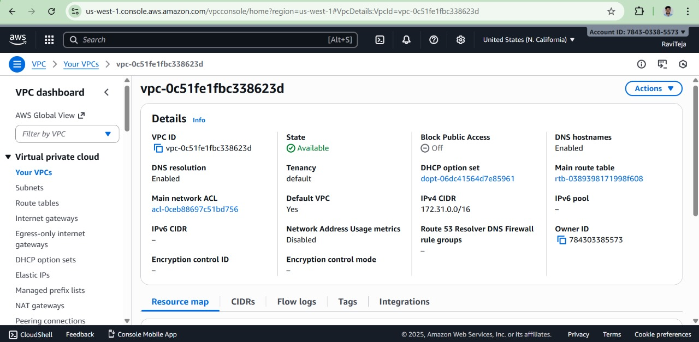

---

# 🏗 AWS Resources Created

### ✔ VPC  


### ✔ Subnets  
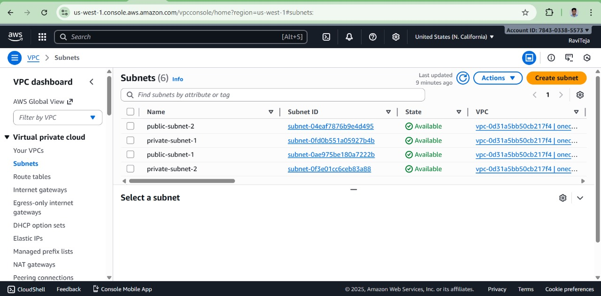

### ✔ Internet Gateway  
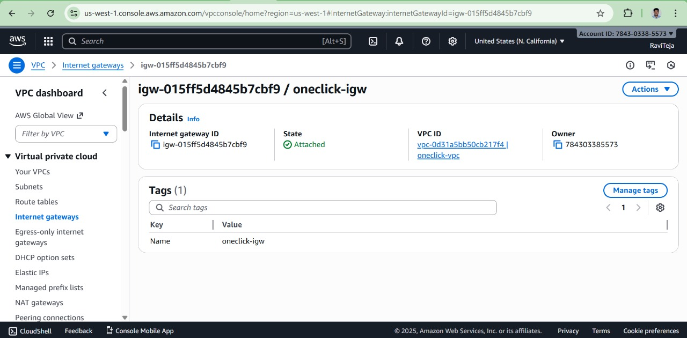

### ✔ NAT Gateway  
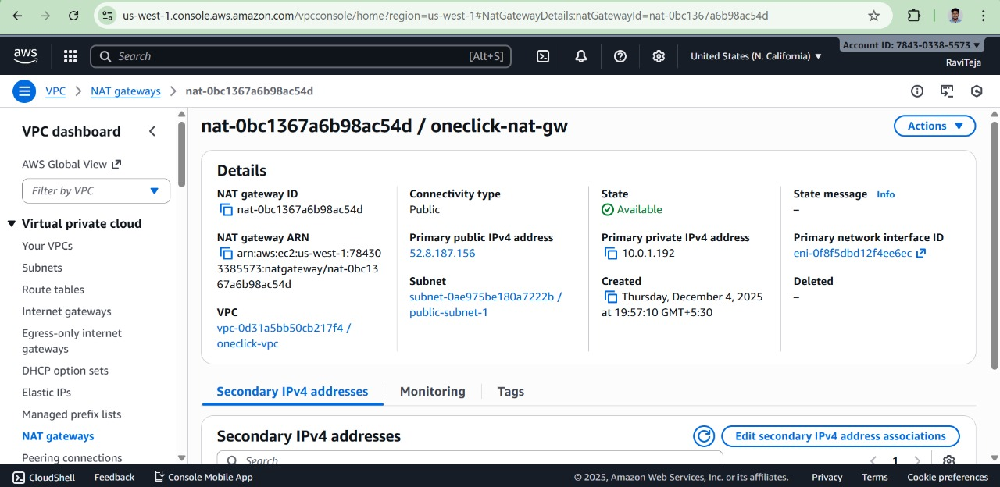

### ✔ Route Tables  


### ✔ Route 53 (Optional Custom Domain)  


### ✔ SSL Certificate (ACM)  
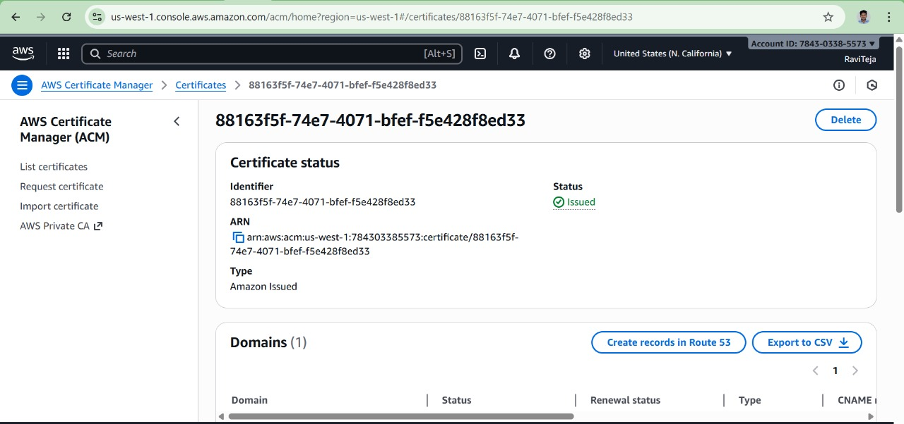

---

# ⚙️ Load Balancer & Target Group

### ✔ ALB  
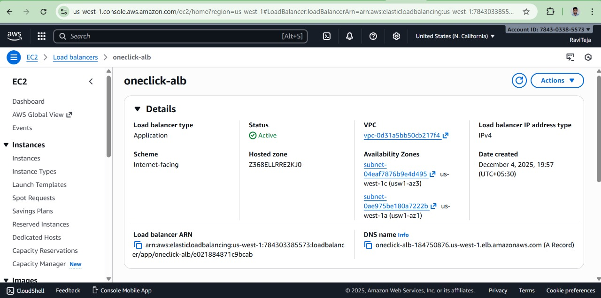

### ✔ ALB DNS Output  
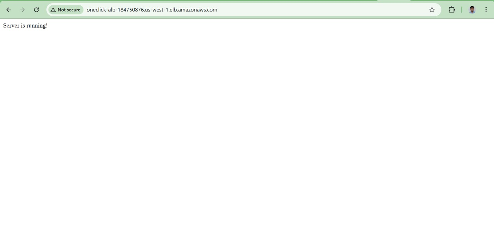

### ✔ ALB `/health` Output  


### ✔ Target Group  
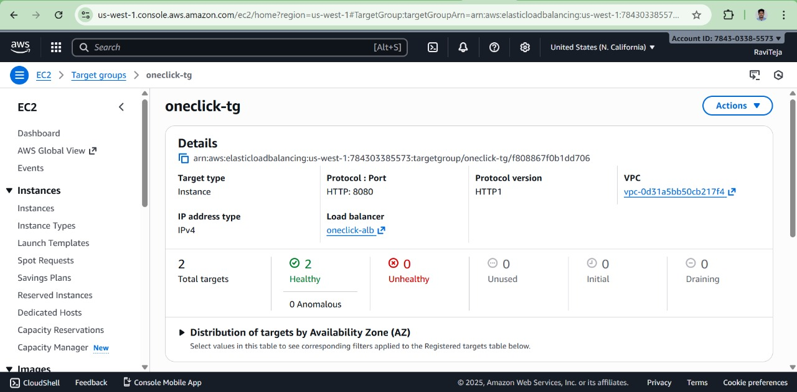

---

# 🖥 Auto Scaling (ASG) & EC2 Instances
# Template
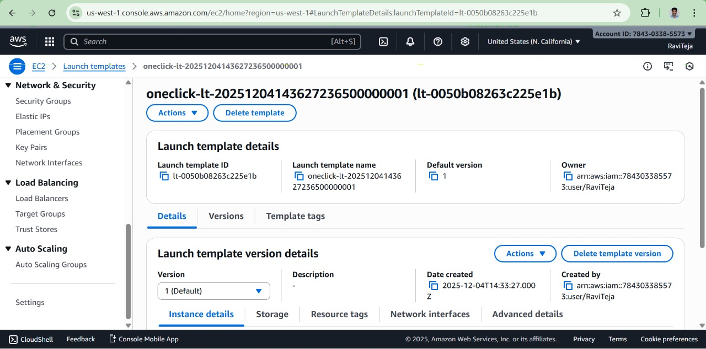

### ✔ Auto Scaling Group  
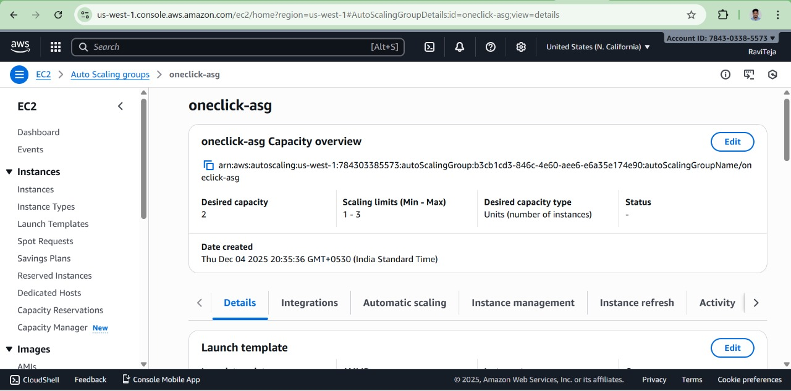

### ✔ EC2 (Private Instance — No Public IP)  
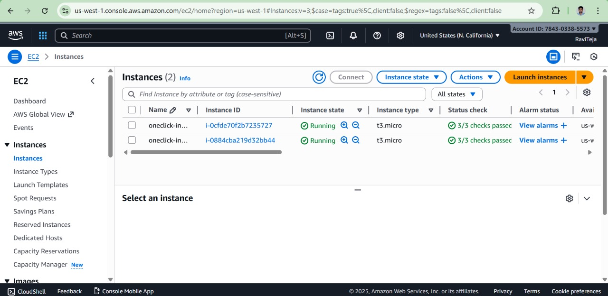

---

# 🔒 Security Groups

### ✔ Secure Group  
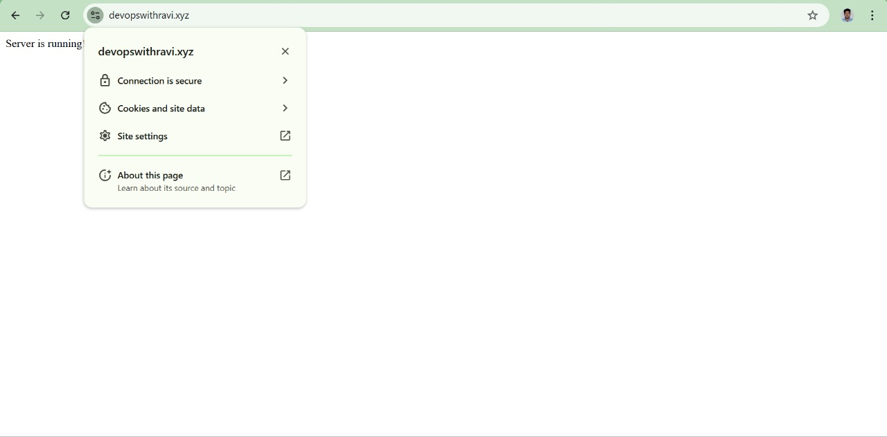

### ❌ Not Secure (For Demonstration Only)  
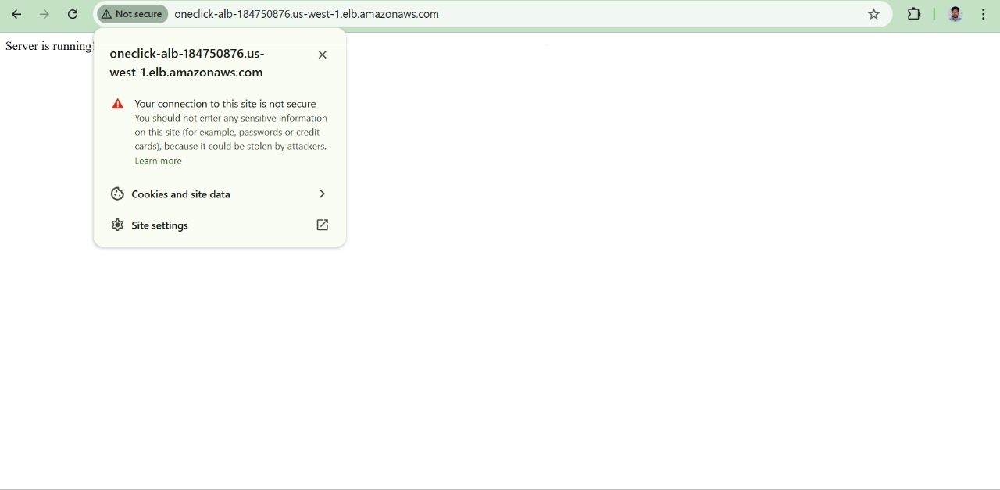

---

# 📡 CloudWatch Logs  
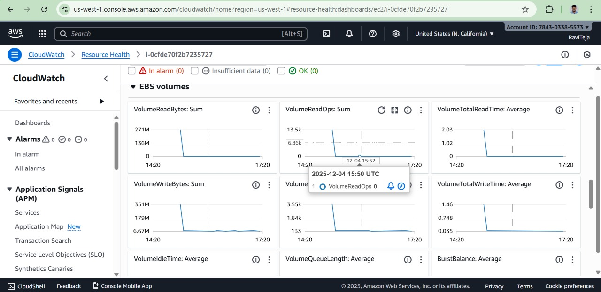

---

# 🌐 Custom Domain & HTTPS (Optional)

### ✔ Custom Domain  
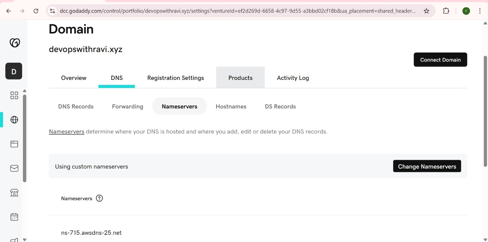

---


---

# 🚀 Deployment Steps

### 1️⃣ Initialize
```sh
cd terraform
terraform init


Project Structure
├── app/
│   ├── app.js
│   └── package.json
├── terraform/
│   └── main.tf
├── scripts/
│   ├── deploy.sh
│   ├── destroy.sh
└── Screenshots/


🚀 Deployment Steps 

This guide explains how the infrastructure and application were deployed using Terraform and AWS services.

1️⃣ Prepare Your Project Structure

Ensure your folder structure looks like:

├── app/
│   └── app.js
│       package.json
├── terraform/
│   ├── main.tf
├── scripts/
│   ├── deploy.sh
│   ├── destroy.sh
└── Screenshots/

2️⃣ Configure AWS CLI
aws configure


Provide:

AWS Access Key

AWS Secret Key

Region → us-west-1

3️⃣ Initialize Terraform

Navigate to your terraform folder:

cd terraform/
terraform init

4️⃣ Deploy the Infrastructure

Run:

terraform apply -auto-approve


Terraform will automatically create:

✔ VPC (public + private subnets)
✔ Internet Gateway
✔ NAT Gateway
✔ ALB
✔ Target Group
✔ Auto Scaling Group
✔ Launch Template
✔ EC2 in private subnets
✔ IAM Role
✔ Security Groups

After deployment, Terraform shows the ALB DNS Name.

5️⃣ Test the Application Using ALB DNS (HTTP)

Copy the ALB DNS from Terraform output:

Example:

http://my-lb-123.us-west-1.elb.amazonaws.com/


Visit in browser:

Root Endpoint
http://<alb-dns>/


Expected output:

Server is running!

Health Endpoint
http://<alb-dns>/health


Expected output:

ok


⚠️ At this stage, the site will show Not Secure
This is normal because ALB is still using HTTP.

🔐 Optional (Recommended): Enable HTTPS + Custom Domain

You enabled HTTPS using Route 53 + ACM, so write these steps:

6️⃣ Create Hosted Zone in Route 53

Open Route 53

Create Public Hosted Zone

Enter your domain (example: devopswithravi.xyz)

Update your domain registrar with the NS records

7️⃣ Request SSL Certificate from ACM

Open ACM (us-east-1)

Request certificate for:

devopswithravi.xyz
*.devopswithravi.xyz


Choose DNS validation

ACM provides CNAME records → Add them to Route 53

Certificate becomes Issued

8️⃣ Enable HTTPS on ALB

Modify ALB listener:

Add listener HTTPS (443)

Attach your ACM certificate

Forward to target group

9️⃣ Route Domain to ALB

In Route 53:

Create A – Alias record

Alias to → Your Application Load Balancer

Save

🔟 Access Your Secure Application
https://devopswithravi.xyz/

https://devopswithravi.xyz/health


✔ Secure HTTPS
✔ Valid SSL
✔ Load Balancer → Private EC2 (via ASG)


🧪 Testing Steps

After your infrastructure is deployed and the application is running behind the Load Balancer, follow the steps below to test that everything works correctly.

1️⃣ Verify the ALB URL or Custom Domain

If you're using your ALB DNS:

http://<your-alb-dns>/


If you configured Route 53 + HTTPS (recommended):

https://devopswithravi.xyz/


This should load your application.

2️⃣ Test the Root Endpoint ( / )

Open your browser or run:

curl https://devopswithravi.xyz/


Expected output:

Server is running!


Confirm this screenshot:
Screenshots/LoadbalacerDNS-Ouput.jpg

3️⃣ Test the Health Endpoint ( /health )

Test via browser:

https://devopswithravi.xyz/health


or:

curl https://devopswithravi.xyz/health


Expected output:

ok


Corresponding screenshot:
Screenshots/Loadbalacer-output health.jpg

4️⃣ Verify ALB Health Checks

Go to AWS Console → EC2 → Target Groups

Select your target group

Check Registered Targets

Ensure health is:

healthy


Screenshot:
Screenshots/TargetGroup.jpg

5️⃣ Verify Private EC2 Instances (No Public Access)

Go to EC2 Console

Check your Auto Scaling Group

Instances must have:

Private IP only

No public IPv4

Running inside private subnets

Screenshot:
Screenshots/EC2.jpg

Try SSH — you should NOT be able to access it (for security reasons).

6️⃣ Validate Load Balancer DNS → EC2 Traffic Flow

This confirms:

✔ ALB is routing traffic
✔ ASG launched instances
✔ User-data bootstrapped the application
✔ NAT gateway allows outbound internet access for app dependencies

7️⃣ Use CloudWatch Logs (Optional)

If EC2 IAM Role includes CloudWatch logging:

/var/log/cloud-init.log
/var/log/messages
application logs from app.js


All logs should show startup messages like:

Server is running!

8️⃣ Confirm Auto Scaling Works (Optional)

To simulate:

Increase CPU load

Or use Update desired capacity in ASG

New instance should deploy automatically and become healthy under ALB.

✅ Testing Complete

Once all tests pass, your deployment is verified end-to-end.

🧹 Teardown Steps

Follow these steps to safely remove all AWS resources and avoid unnecessary charges.

1️⃣ Navigate to the Scripts Directory
cd scripts/

2️⃣ Run the Destroy Script

Make the script executable (if not already):

chmod +x destroy.sh


Run:

./destroy.sh


This script will:

✔ Run terraform destroy -auto-approve
✔ Delete all infrastructure created by Terraform
✔ Remove:

VPC

Public & private subnets

Internet + NAT Gateway

Route tables

Application Load Balancer

Target group

Auto Scaling Group

Launch Template

Security groups

IAM roles

EC2 instances

Any other Terraform-managed resources

3️⃣ (Optional) Delete Route 53 Hosted Zone & Domain Records

If you used a custom domain:

Go to Route 53 → Hosted Zones

Select your hosted zone (devopswithravi.xyz)

Delete A records, CNAMEs, ALIAS records

Finally delete the hosted zone (cannot delete until empty)

4️⃣ (Optional) Delete ACM Certificate

If you're not using your domain elsewhere:

Go to ACM

Find your certificate

Delete it

5️⃣ Verify All Resources Are Removed

In AWS Console, verify:

No Load Balancers

No Auto Scaling Groups

No EC2 instances

No NAT Gateway (expensive!)

No VPC associated resources

No Elastic IP

✅ Teardown Complete

Your AWS environment is now fully cleaned and free from ongoing charges.

